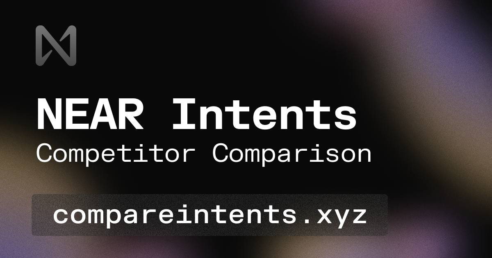

A dashboard for all things NEAR intents, providing bridge data and analytics across multiple providers.

**Live deployment:** [compareintents.xyz](https://compareintents.xyz)

## Development

```bash
# Start docker (Redis for cache)
docker compose up -d

# Install dependencies
bun install

# Start development
bun run dev            # Start web + server
```

The web UI will be available at `http://localhost:3001`

## Contributing

### Adding a New Provider

1. **Generate plugin from template**:

   ```bash
   bun run generate
   ```

   Follow the prompts to create a new plugin.

2. **Implement the data provider methods** in `src/service.ts`:
   - `getVolumes()` - Fetch volume metrics for time windows
   - `getListedAssets()` - Return all supported assets
   - `getRates()` - Get exchange rate quotes
   - `getLiquidityDepth()` - Measure liquidity depth at slippage thresholds

3. **Register your plugin** in `packages/api/src/plugins.ts`:
   - Add your plugin to the `PLUGIN_URLS` configuration
   - Import and add type declaration
   - Include in `initializePlugins()` function

4. **Test your implementation**:

   ```bash
   cd plugins/your-provider
   bun run test
   ```

## License

Part of the NEAR Intents data collection system.
